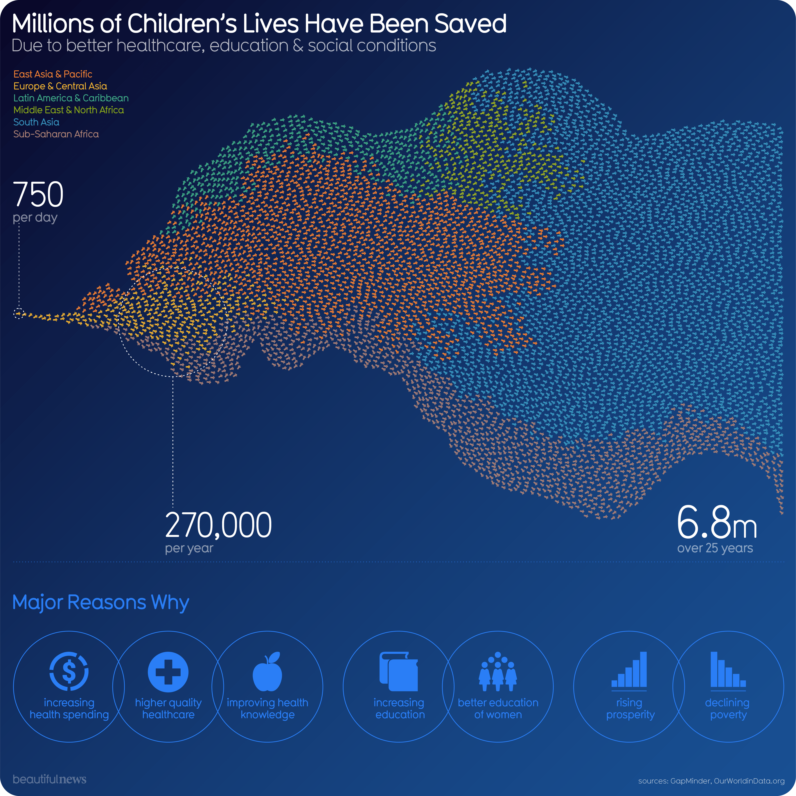

```{r setup, include=FALSE}
knitr::opts_chunk$set(echo = TRUE)
```

## Visualization of Millions of Children's Lives Have Been Saved

One direct effect of human progress is longer lives. 100 years ago, nearly half the world’s children died before the age of 5. Today it’s less than 4%. Meaning millions have had a chance at life. That’s progress. <http://rmarkdown.rstudio.com>.
```{r, fig.align="center", fig.cap="Figure 1: The image to be redesigned."}

```
When you click the **Knit** button a document will be generated that includes both content as well as the output of any embedded R code chunks within the document. You can embed an R code chunk like this:

```{r library}
library(tidyverse)
library(ggplot2)
library(RColorBrewer)
library(ggthemes)
library(ggrepel)
library(directlabels)
library(scales)
```

```{r read data}
lives <- read.csv("Children Deaths.csv", header = TRUE, stringsAsFactors=FALSE)
str(lives)
```

```{r rename}
colnames(lives)[2] <- "E. Asia & Pacific"
colnames(lives)[3] <- "Eurasia"
colnames(lives)[4] <- "Latin America & Carribean"
colnames(lives)[5] <- "South Asia"
colnames(lives)[6] <- "Middle East & N. Africa"
colnames(lives)[7] <- "N. America"
colnames(lives)[8] <- "Sub Saharan Africa"
drops <- c("World")
changeLives <- lives[ , !(names(lives) %in% drops)]
```

```{r reshape data}
meltedLives <- reshape2::melt(changeLives, id.var='Year')
view(meltedLives)
```

```{r fig.align="center", fig.cap="Figure 1: The visualization redesigned."}}


lifePlot <- ggplot(meltedLives, 
                   aes(x = Year, y = value, col = variable)) + 
  geom_line(size = 1, alpha = 2) +
  scale_x_continuous(breaks = c(1990, 1995, 2000, 2005, 2010, 2015, 3000), 
                     expand = c(0, 0)) +
  scale_y_continuous(labels = label_comma()) +
  coord_cartesian(ylim=c(0, 5000000)) +
  labs(title="Millions of Children's Lives Have Been Saved", 
       subtitle="Due to better healthcare, education, & social conditions",
       x=element_blank(),
       y="Mortality Rate", 
       col = "Countries",
       caption="Sources: GapMinder, OurWorldinData.org") +
  scale_color_calc() +
  theme(legend.position="none") 

lifePlot + geom_dl(aes(label = variable, color = variable), 
          method = list("smart.grid"))

ggsave("ChildenSaved.png", width = 5, dpi = 2400)
```
###References

Alex Gray. (2017) Infant mortality has halved since 1990, but there's still work to be done | World Economic Forum. Retrieved March 09, 2020, from <https://www.weforum.org/agenda/2017/03/122-million-one-number-that-proves-how-life-has-changed-for-the-poorest/>

Information Is Beautiful. (2020) Millions of Children's Lives Have Been Saved — Beautiful News. Retrieved , from <https://informationisbeautiful.net/beautifulnews/595-childrens-lives-saved/>

```{r}
citation(package = "tidyverse")
citation(package = "ggplot2")
citation(package = "RColorBrewer")
citation(package = "ggthemes")
citation(package = "directlabels")
citation(package = "scales")
```